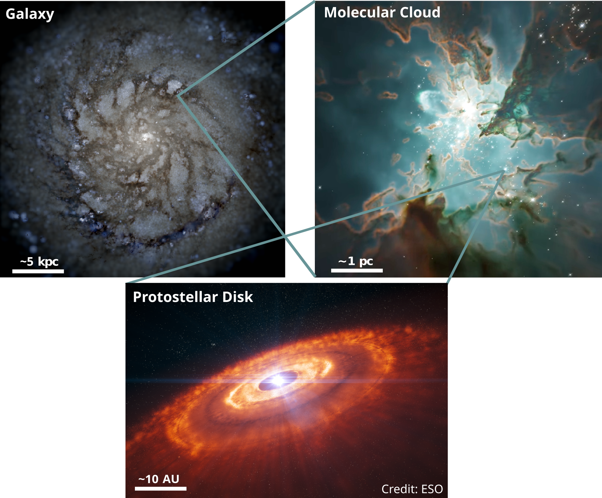
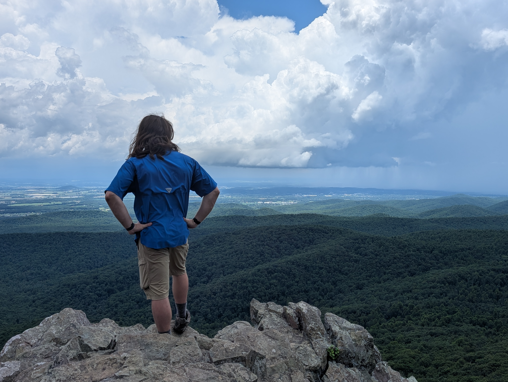

I'm Dr. Caleb Choban, an inaugural Sullivan Prize Fellow in [Astronomy at IU Bloomington](https://astro.indiana.edu/index.html). My research utilizes simulations of galaxies to understand interstellar dust grains, numerous small particles (<1 μm) residing in the interstellar medium. These grains absorb starlight, indirectly make stars, and grow into exoplanets to name just a few of the amazing things they do.

{:.lead width="800" height="100" loading="lazy"}

Dust plays a role in the formation of galaxies, stars, and exoplanets
{:.figcaption}

# About Me

I grew up in the small town of Templeton in central California. 
I completed a B.Sc. in Physics at UC San Diego in 2016, 
were my work developing the SPLAT brown dwarf analysis toolkit with [Prof. Adam Burgasser](https://www.coolstarlab.org/) fostered my interests in coding and astronomy. 
I received a Ph.D. in Physics at UC San Diego in 2023, working with [Prof. Dušan Kereš](https://physics.ucsd.edu/people/profile?profile_id=537) and collaborating with [Prof. Karin Sandstrom](https://karinsandstrom.github.io/), were I used big simulations to understand small interstellar dust grains. 

Outside of research, I enjoy camping and hiking in national/state parks, rock climbing (only indoors so far), cycling and walking around the beautiful California coastline and Indiana forests and playing a good board game.

{:width="400" height="398" loading="lazy"}
{:width="400" height="398" loading="lazy"}
