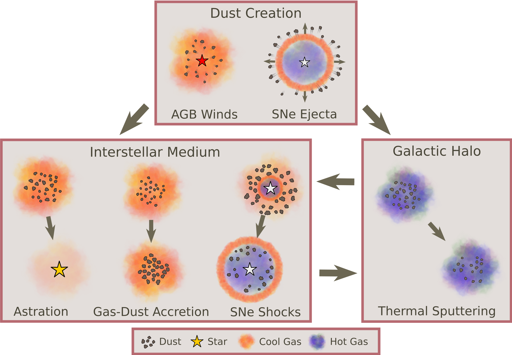

<!--  -->

<h2 class="h1" style="color: {{site.theme_color}}" id="about">About Me </h2>

Hi! I'm Caleb. I am a PhD candidate in [Physics](https://physics.ucsd.edu/) and [Astronomy](https://astronomy.ucsd.edu/) at UC San Diego. My research focuses on modelling dust, its life cycle, and its effects on and interactions with the ISM. I am currently interested in how dust effects galaxy evolution and observations utilizing cosmological zoom-in simulations. I am also interested in how we model ISM physics, particularly chemical networks and radiative transfer in the ISM. 

When my mind isn't dusty I enjoy camping and hiking in national parks, cycling and walking around the beautiful California coastline, and playing a good board game.

{: width="400" height="100" loading="lazy"} {: width="400" height="100" loading="lazy"} 
{:.lead width="800" height="100" loading="lazy"}

{: width="200" height="100" loading="lazy"}

[To center images need to use HTML.]: # 

  

  <ul>
    <li> <a href="https://www.linkedin.com/in/cchoban" title="LinkedIn" class="no-mark-external" target="_blank">  LinkedIn LinkedIn profile</a></li>
    <li> <a href="https://orcid.org/0000-0001-9200-169X" title="Orcid" class="no-mark-external" target="_blank">  Orcid LinkedIn profile</a></li>
    <li> <a href="https://twitter.com/cchoban" title="Twitter" class="no-mark-external" target="_blank">  Twitter Twitter profile</a></li>
  </ul>

---
<h2 class="h1" style="color: {{site.theme_color}}" id="research">Research </h2>

<h3 class="h2">Current Projects</h3>
**Modeling Dust Evolution in Cosmological Zoom-In Simulations**  
*Advisor: [Dusan Keres](https://cass.ucsd.edu/index.php/faculty:Dkeres)*

Descriptions

<h3 class="h2">Past Projects</h3>
**FILL IN**    
*Advisor: [Adam Burgasser](https://cass.ucsd.edu/index.php/faculty:Aburgasser)*

Description

---
<h2 class="h1" style="color: {{site.theme_color}}" id="publications">Publications </h2>

<h3 class="h2">Peer-reviewed Conference Papers</h3>

* **EXAMPLE** and example. Title. In *Journal*

  
<h3 class="h2">Journal Article</h3>

<h3 class="h2">Presentations</h3>

  

---
<h2 class="h1" style="color: {{site.theme_color}}" id="contact">Contact </h2>

Center for Astrophysics and Space Sciences (CASS)   
University of California San Diego   
9500 Gilman Drive   
La Jolla, CA 92093, USA

**cchoba<!-- tyewcnpy -->n [a<!-- juygv -->t] u<!-- tregbijd -->cs<!-- rzyjide --->d [dot] edu**
{:.lead}

