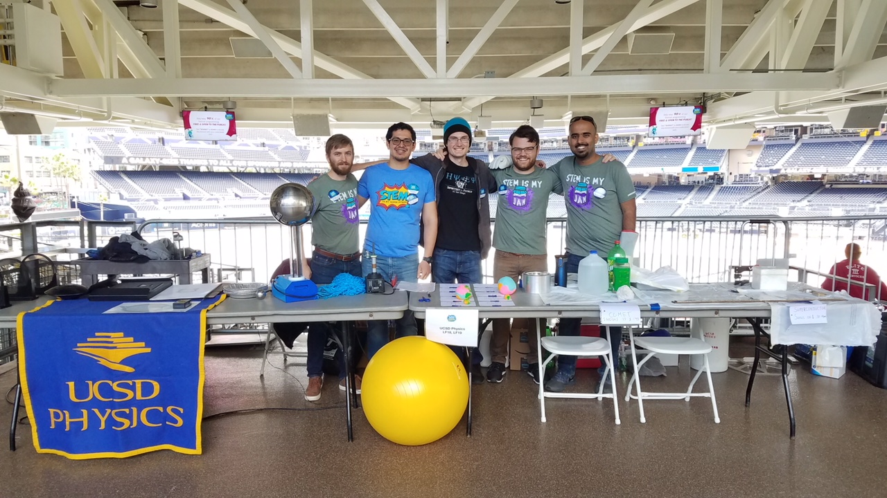
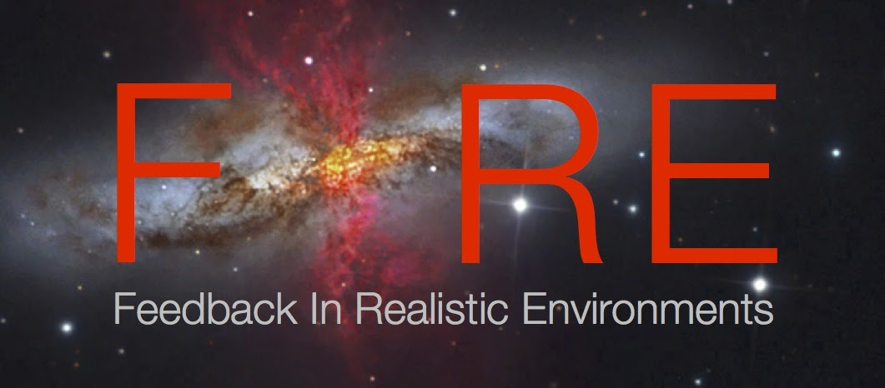

<!--  -->

<h2 class="h1" style="color: {{site.theme_color}}" id="about">About Me </h2>

Hi! I'm Caleb Choban, a PhD candidate in [Physics](https://physics.ucsd.edu/) and [Astronomy](https://astronomy.ucsd.edu/) at UC San Diego working in collaboration with Prof. Dušan Kereš. My research focuses on modeling dust, its life cycle, and its effects on and interactions with the ISM, utilizing cosmological zoom-in simulations as part of the Feedback in Realistic Environments ([FIRE](https://fire.northwestern.edu/)) project. I am currently interested in how modeling dust evolution affects how galaxies evolve and using dust models to determine the expected dust extinction curves and emission spectra in various gas and galactic environments, to help interpret and guide observations. I am also interested in how we model ISM physics, particularly chemical networks and radiative transfer in the ISM. 

<figure>
    
</figure>

Beyond research, I serve as a class representative on the Physics Graduate Council ([PGC](https://sites.google.com/a/physics.ucsd.edu/physics-graduate-council/)) interfacing with department committees and chair to advocate for the graduate population. My recent endeavors include backing an increase in graduate stipends to reduce rent burden and improving work-life balance for first-year students by establishing a flexible teaching workload. During my tenure, I founded a physics mentorship program pairing undergraduate mentees with graduate mentors to provide students guidance on various challenges ranging from graduate school applications to course selection. I am also interested in community outreach, teaching extracurricular labs for local public schools, leading Python coding and research workshops for transfer and local community college students, and running astronomy and physics demonstrations at numerous public science events.

In my spare time I enjoy camping and hiking in national parks, cycling and walking around the beautiful California coastline, and playing a good board game.

{: width="500" height="100" loading="lazy"} 

  <ul>
    <li> <a href="https://www.linkedin.com/in/cchoban" title="LinkedIn" class="no-mark-external" target="_blank">  LinkedIn LinkedIn profile</a></li>
    <li> <a href="https://orcid.org/0000-0001-9200-169X" title="Orcid" class="no-mark-external" target="_blank">  Orcid LinkedIn profile</a></li>
    <li> <a href="https://twitter.com/cchoban" title="Twitter" class="no-mark-external" target="_blank">  Twitter Twitter profile</a></li>
    
  </ul>

---
<h2 class="h1" style="color: {{site.theme_color}}" id="research">Research </h2>

<h3 class="h2">Current Projects</h3>
**Modeling Dust Evolution in Cosmological Zoom-In Simulations**  
*Advisor: [Dušan Kereš](https://cass.ucsd.edu/index.php/faculty:Dkeres)*

<figure>
    
</figure>

 Dust is integral to the physics within the ISM, providing a surface for complex astrochemistry, reducing the abundance of gas phase coolants, affects ISM radiation pressure, and redistributes galactic SEDs. Observations find diverse dust scaling relations which suggest a complex dust system depending heavily on local gas properties, but many galaxy formation models do not capture this, treating dust in post-processing or assume a constant dust-to-metals ratio (D/Z=0.4). Recent strides have been made developing dust evolution models for galaxy formation simulations but these approaches vary in their assumptions and degree of complexity. Based on these approaches I developed two separate dust evolution models which track dust by 'Element' and dust by 'Species'. I integrated both models into the magneto-hydrodynamics code GIZMO coupled to the FIRE-2 model for stellar feedback and ISM physics, and compared them in idealized MW-like galaxy simulations. I demonstrated that while both models can produce reasonable galaxy-integrated results, the dust by 'Species' approach reproduces the diverse dust scaling relations observed in the MW.

<h3 class="h2">Past Projects</h3>
**FILL IN**    
*Advisor: [Adam Burgasser](https://cass.ucsd.edu/index.php/faculty:Aburgasser)*

Description

---
<h2 class="h1" style="color: {{site.theme_color}}" id="publications">Publications </h2>

<h3 class="h2">Peer-reviewed Conference Papers</h3>

* **EXAMPLE** and example. Title. In *Journal*

  
<h3 class="h2">Journal Article</h3>

<h3 class="h2">Presentations</h3>

  

---
<h2 class="h1" style="color: {{site.theme_color}}" id="contact">Contact </h2>

Center for Astrophysics and Space Sciences (CASS)   
University of California San Diego   
9500 Gilman Drive   
La Jolla, CA 92093, USA

**cchoba<!-- tyewcnpy -->n [a<!-- juygv -->t] u<!-- tregbijd -->cs<!-- rzyjide --->d [dot] edu**
{:.lead}

