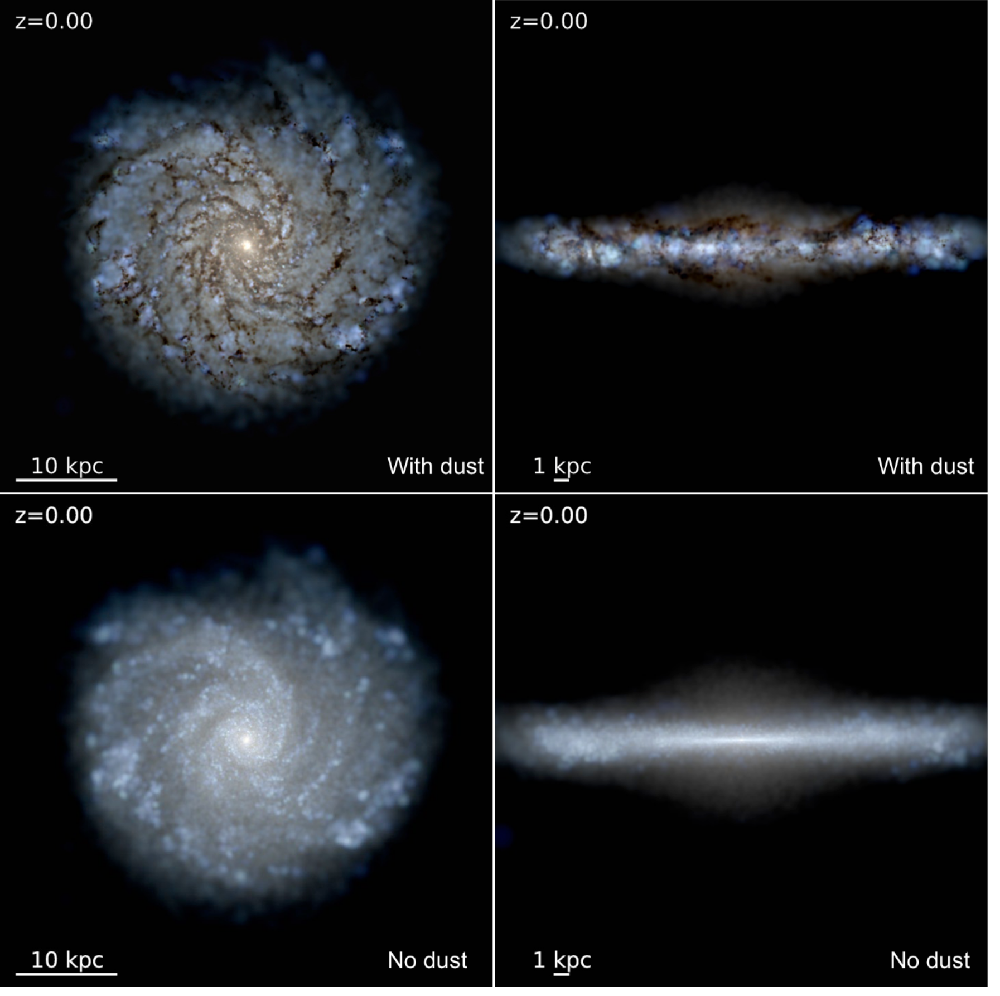

<!--  -->

<h2 class="h1" style="color: {{site.theme_color}}" id="about">About Me </h2>

 I'm Caleb Choban, an inaugural Sullivan Prize Fellow in [Astronomy](https://astro.indiana.edu/index.html) at IU Bloomington. I received my Ph.D. in Physics at [UC San Diego](https://astronomy.ucsd.edu/) working in collaboration with Prof. [Dušan Kereš](https://physics.ucsd.edu/people/profile?profile_id=537). My research focuses on interstellar dust grains, numerous small particles (<1 μm) that reside within the interstellar medium (ISM). I am interested in the dust life cycle, how dust evolves within galaxies, and how dust affects and interacts with the ISM. In particular, I utilize simulations of individual galaxies, called cosmological zoom-in simulations, and am part of the Feedback in Realistic Environments ([FIRE](https://fire.northwestern.edu/)) project. 
 With these simulations, I test our understanding of interstellar dust by modeling dust evolution from its initial creation in the first supernovae and across cosmic time. I also create simulated observations of dust extinction curves, dust emission spectra, and gas-phase element depletions in various gas and galactic environments to help interpret and guide observations. Beyond dust, I am also interested in how we model ISM physics, chemical networks, and radiative transfer. 

<figure>
    
</figure>

Beyond research, I am interested in community outreach and graduate student advocacy. I have taught extracurricular labs for local public schools, led Python coding and research workshops for transfer and local community college students, and organized astronomy and physics demonstrations at numerous public science events. 
<!-- I also help run public telescope viewings at the [Kirkwood Observatory](https://astro.indiana.edu/outreach/kirkwood-observatory/kirkwood-schedule.html) in Bloomington. -->
As a graduate researcher, I also served as a class representative on the Physics Graduate Council ([PGC](https://sites.google.com/a/physics.ucsd.edu/physics-graduate-council/)) interfacing with department committees and chair to advocate for the graduate population. During my tenure, I pushed for an increase in graduate stipends to reduce rent burden and helped estalish a flexible teaching workload for first-year students to improve work-life balance. I also founded a physics mentorship program pairing undergraduate mentees with graduate mentors to provide students guidance on various challenges ranging from graduate school applications to course selection.

In my spare time I enjoy camping and hiking in national/state parks, cycling and walking around the beautiful California coastline and Indiana forests, and playing a good board game.

{: width="500" height="100" loading="lazy"} 

  <ul>
    <li> <a href="https://www.linkedin.com/in/cchoban" title="LinkedIn" class="no-mark-external" target="_blank">  LinkedIn LinkedIn profile</a></li>
    <li> <a href="https://orcid.org/0000-0001-9200-169X" title="Orcid" class="no-mark-external" target="_blank">  Orcid LinkedIn profile</a></li>
    <li> <a href="https://twitter.com/cchoban" title="Twitter" class="no-mark-external" target="_blank">  Twitter Twitter profile</a></li>
    
  </ul>

[{: width="250" height="100" loading="lazy"}](https://fire.northwestern.edu/)

---
<h2 class="h1" style="color: {{site.theme_color}}" id="research">Research </h2>

<h3 class="h2">Interstellar Dust</h3>

Although it constitutes only 1% of the ISM by mass, dust is integral to the physics within. It provides a surface for astrochemistry such as H2 formation, facilitating the formation of molecular clouds and, indirectly, the stars that form within them.
Dust grains are also a critical mediator for feedback around star-forming regions, translating radiation pressure onto nearby gas. This pressure halts the infall of nearby gas, regulating local star formation, and drives galactic winds, shaping galaxy evolution.
Dust is also a critical heating and cooling source in various phases of the ISM, cooling hot plasmas and extremely dense gas by radiating IR light and heating neutral gas via photoelectric heating.
Observationally, dust absorbs ultraviolet/optical light and emits in the infrared affecting all astronomical observations to varying degree (check out the image below to see what a Milky Way-like galaxy looks like with and without dust).

For a cool animated video explaining dust check out the video below featuring Prof. [Karin Sandstrom](http://karinsandstrom.github.io/), one of my collaborators.

<!-- Put image and youtube video in a table to make them side by side -->
<table><tr>
<td style="width:50%;background:transparent;border:none;" >
</td>
<td style="width:50%;background:transparent;border:none;">
<iframe width="560" height="315" src="https://www.youtube.com/embed/8bRy5VDJsTI" frameborder="0" allow="encrypted-media;" allowfullscreen></iframe></td>
</tr></table>

Interstellar dust so has a complicated life cycle composed of processes during which they can be created, destroyed, grown, or eroded. 

<figure>
    
</figure>

  * **Dust Creation**: The initial seeds of the dust population are created in the stellar ejecta of supernovae and the winds of asymptotic giant branch (AGB) stars where a portion of ejected metals condense into dust.
  * **Gas-Dust Accretion**: In cool, dense phases of the ISM, gas-phase metals accrete onto the surface of preexisting dust grains growing the grains over time. This is believed to be the main producer of dust mass but not much is known about this physical process/.
  * **SNe Shocks**: As supernovae remnants propagate through the ISM they destroy and shatter dust grains residing in the ISM via grain-grain collisions, thermal sputtering, and non-thermal sputtering. 
  * **Astration**: As gas cools and collapses forming stars, dust residing in said gas is also destroyed and contributes to the stellar composition. 
  * **Thermal Sputtering**: Dust grains residing in hot gas, such as in the galactic halo, are eroded and destroyed by energetic atoms.

<h3 class="h2">Modeling Dust Evolution in Cosmological Zoom-In Simulations</h3>

Observations find diverse dust scaling relations which suggest a complex dust system depending heavily on local gas properties, but many galaxy formation models do not capture this, treating dust in post-processing or assume a constant dust-to-metals ratio (D/Z=0.4). Recent strides have been made developing dust evolution models for galaxy formation simulations but these approaches vary in their assumptions and degree of complexity. Based on these approaches I developed two separate dust evolution models (labelled 'Elemental’ and 'Species’) which include the main mechanisms comprising the dust life cycle and incorporated them into the magneto-hydrodynamics GIZMO code coupled to the FIRE-2 model for stellar feedback and ISM physics. The “Elemental” model tracks the evolution of generalized dust species and utilizes a simple, ‘tunable’ dust growth routine, while the “Species” model tracks the evolution of specific dust species with set chemical compositions and incorporates a physically motivated, two-phase dust growth routine. Utilizing idealized Milky Way-like galaxy simulations, I demonstrated that while both models can produce reasonable galaxy-integrated results, the dust by 'Species' approach reproduces the diverse dust scaling relations observed in the MW.

---
<h2 class="h1" style="color: {{site.theme_color}}" id="publications">Publications </h2>

A full list of my publications can be found on ADS [here](https://ui.adsabs.harvard.edu/public-libraries/-Gcrfa83Qq2xs8ndJylF0A).

<!--   
<h3 class="h2">First Author Publications</h3>

<h3 class="h2">Presentations</h3>
 -->
  

---
<h2 class="h1" style="color: {{site.theme_color}}" id="contact">Contact </h2>

Department of Astronomy \\
Indiana University \\
727 East 3rd Street \\
Swain West 318 \\
Bloomington, IN 47405 

**cch<!-- hsjusm -->oba<!-- tyewcnpy -->n [a<!-- juygv -->t] i<!-- tregbijd -->u<!-- rzyjide ---> [dot] edu**
{:.lead}

